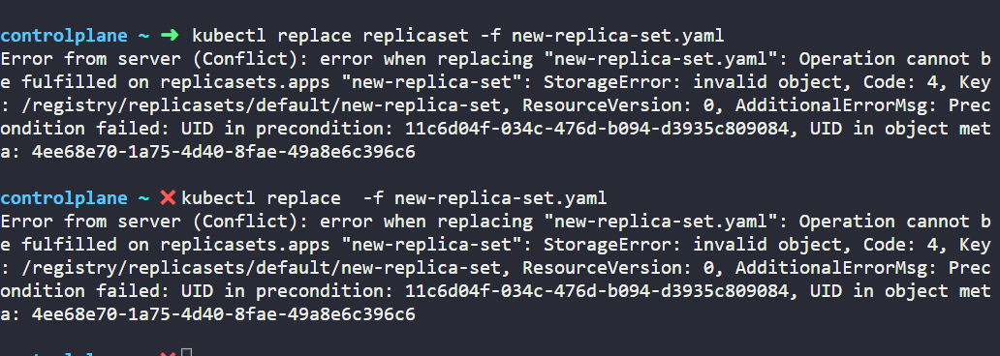
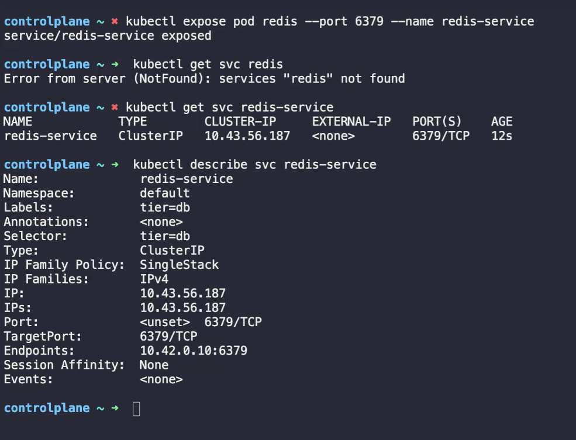

### Recap pods  
Assume single node cluster enabled  
- K8 should deploy our application in wroker node it can not deploy application contianer alone in node, it will wrap with the K8 small object called POD.  
    pods are very small objects we can craete  
    Single container docker encapsulated in one POD, how would if more traffic for the app we can not create same app in same POD. we need to create additional pod in cluster in diferent node.  
    Always container has one to one mapping, each container should run in separate pod. A single pod can run multiple different container like helper contianer to support the application like DB. both can communicate with localhost hence it is sharing the same network in same pod.  
        &nbsp;&nbsp;&nbsp;&nbsp;&nbsp;&nbsp;&nbsp;&nbsp;&nbsp;`docker run python-app` --> new app will deploy and run  
         &nbsp;&nbsp;&nbsp;&nbsp;&nbsp;&nbsp;&nbsp;&nbsp;&nbsp;`docker run python-app` --> new app will deploy and run  
         &nbsp;&nbsp;&nbsp;&nbsp;&nbsp;&nbsp;&nbsp;&nbsp;&nbsp;`docker run python-app` --> new app will deploy and run   
         &nbsp;&nbsp;&nbsp;&nbsp;&nbsp;&nbsp;&nbsp;&nbsp;&nbsp;`kubectl run nginx --image nginx` --> k8 will download the image from dockerhub and create new pod in cluster  
         &nbsp;&nbsp;&nbsp;&nbsp;&nbsp;&nbsp;&nbsp;&nbsp;&nbsp;`kubectl get pods` --> list the pods  

### POD with YAML file  
pod-defination.yaml  
```yaml
apiVersion: v1
kind: Pod
metadata:
  name: myapp-1
  labels:
   app: myapp
   type: front-end
spec:
  containers:
    - name: my-nginx-container
      image: nginx 
```  
`kubectl create -f pod-defination.yaml`  
`kubectl get pods -o wide` --> to know abou the node & IP 

kubectl pod status Ready column 1/2 --> one container is running /total containers   
Pod events section will have the logs for failures.  
Dry Run (--dry-run=client):  it will create yaml file no need to create and write yaml file.  
`kubectl run redis --image=redis --dry-run=client -o yaml`  
  - If you are given a pod definition file, edit that file and use it to create a new pod.
  - If you are not given a pod definition file, you may extract the definition to a file using the below command
  `kubectl get pod <podname> -o yaml > pod-defination.yaml`
  Then edit the file to make the necessary changes, delete, and re-create the pod.  
  - To modify the properties of the pod, you can utilize the kubectl edit pod <pod-name> command. Please note that only the properties listed below are editable.  
          - spec.containers[*].image  
          - spec.initContainers[*].image
          - spec.initContainers[*].image  
          - spec.tolerations  
          - spec.terminationGracePeriodSeconds  
### Recap - ReplicaSet  
  Kube Controllers: brain behind kuberneties  

  Replication Controller: If pod crashes due to some reasons user can not access application, Replication Controller will brings up the pod autometically to provide HA (High Availability). RC will bring up pod even it has single pod defined.  
  Balance the load across different pod and replication controller will span across the different nodes to balance node resources. scale the applications based on user demand.  

  ReplicaSet: both are same. it is new way.  

  ```YAML
  apiVersion: apps/v1
  kind: ReplicaSet
  metadata:
    name: my-app-replicaset
    labels:
       app: my-app
       type: frontend
  spec:
    template:
      metadata:
        name: my-app
        labels:
          type: frontend
          app: my-app
      spec:
        continaers: 
          - name: nginx-controller
            image: nginx
    replicas: 3
    selector:
      matchlabels:
        type: frontend
  
  ```  

  `kubectl create -f  replicaset-def.yaml`  
  `kubectl get replicaset`  
  `kubectl get pods`
  Labels & Selectors:  
  Replicaset will keep on monitor the pods and if it detects any pod down then it will deploy new application and brings up the pod alwyas ensure to be 3 pods are up & running.  
  how does RS know which pods in cluster so matchlables will use to filter the required pods.  
  Scale:  
  1. update replicas in defination yaml file to 6 and use replace command  
    &nbsp;&nbsp;`kubectl replace -f replicaset-def.yaml`  
    ? Why I can't use kubectl apply command after updating the def yaml file, what will happen if I run apply command.  
         apply command will return error that already existed need to delete and create new one using create command but it will have some downtime so use replace command.
  2. using scale argument  
    
     &nbsp;&nbsp;`kubectl scale --replicas=6 -f replicaset-def.yaml` --> def yaml file still have replicas: 3 only  
     &nbsp;&nbsp; `kubectl scale --replicas=6 replicaset myapp-replicaset`
  
  There are other options to autometically scale the applications based on load, that is advance topic.  

  Review Commands:  
     `kubectl create -f  replicaset-def.yaml`  
     `kubectl get replicaset`  
     `kubectl delete replicaset myapp-replicaset`  
     `kubectl replace -f replicaset-def.yaml`  
     `kubectl scale --replicas=6 -f replicaset-def.yaml`  

  In practise test, I have edited the replicaset by correcting the correct image name busybox and expected to be pods auto rolledup with valid image by deleting the existing pods but not happend.
    - I have deleted the one existing pod which has the error state then replicaSet ensures the 4 pods so deployed new application with valid image and repeted the same for nwext pod then working. next step is below one by  using create command.


  Kubectl is returning error if we are trying to create replicaset using create command if already replicset created in cluster. already exists.. need to delete the existing Replicaset object from kube then use create command.  

   1. Tried by editing the RS and created new pod autometically unlike the image update where existing pods did not effect.  
   2. rolledback replicas to 4 by edit command then k8 deleted one pod which recently created. executed `kubectl scale --replicas=5 replicaset myapp-replicaset` new pod created it did not touch already running pods.  
   3. rolledback replicas to 4 by edit command then k8 deleted one pod which recently created. now 4 pods. executed `kubectl scale --replicas=6 -f replicaset-def.yaml` same new pod created but actual pysical yaml file still having 4 but replicaset object is having 5  
   4. edited replicaset def yaml file and used `kubectl replace -f new-replica-set.yaml` but returned error 

  

 Useful command to understand `kubectl explain replicaset`  
`kubectl delete podd_1 pod_2 pod_3`  

### Recap - Deployments  
### Recap - Namespace  

Default Namespace will be created to use  
kube system: all kube related objects will create  
kube public: open to create different  
Name space can have resource limit like CPU, Memory  
Within same name space each can communicate with service name if differentnamespace db-service.dev{namespace}.svc.cluster.local{default domain name}

`kubectl config set-context $(kubectl config current-context) -n=dev`--> it will set the context no need to mention  
`kubectl get pods -A` --> it will list all the pods from all defined name spaces.  
#### Resource quota
```YAML
apiVersion: v1
kind: ResourceQuota
metadata:
  name: compute-quota
  namespace: dev
spec:
  hard:
    pods: "10"
    requests.cpu: "4"
    requests.memory: 5Gi
    limits.cpu: "10"
    limits.memory: 10Gi


```

Q) what would be the DNS  name for DB which running on same marketing namespace:  
 &nbsp;&nbsp;&nbsp; `kubectl get svc -n=marketing`  --> two services created with pod names  like `https://db-service:9444 `

 Q) What wolud be the DNS name should use to connect different namespace dev to connect DB server.  `htpps://db-service.dev.svc.cluster.local:9445`  

 ### Certification Tips: Imperative command  

- --dry-run: By default, as soon as the command is run, the resource will be created.   
- dry-run=client: it will not create resource it will just tsest the command by whether resource can created and your command is correct  

- -o yaml: This will output the resource definition in YAML format on the screen.  

1) Generate POD Manifest YAML file (-o yaml). Don't create it(--dry-run)  
        `kubectl run nginx --image=nginx --dry-run=client -o yaml` 
2) create deployment  
        `kubectl create deployment --image=nginx nginx --dry-run -o yaml`   

Q) Create service  redis-service to expose the redis application with cluster on port 6379  
 `kubectl expose pod redis --port=6379 --name=redis-service`  
 `kubectl get svc redis-service`  
    
Q) create nginx pod should run on port 8080 within container  
`kubectl run nginx --image=ng-inx --port=8080`  